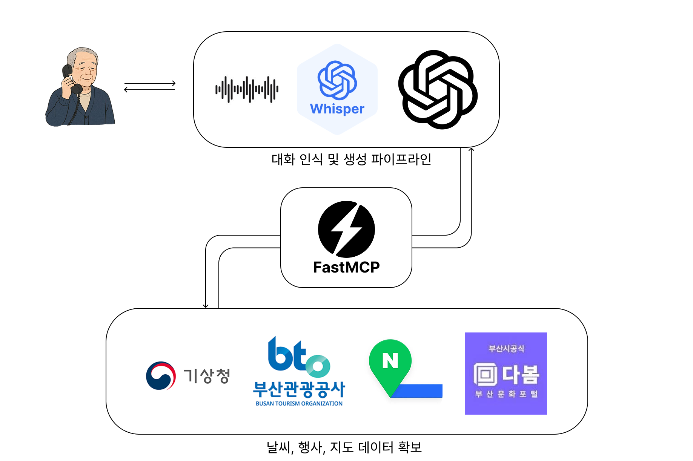
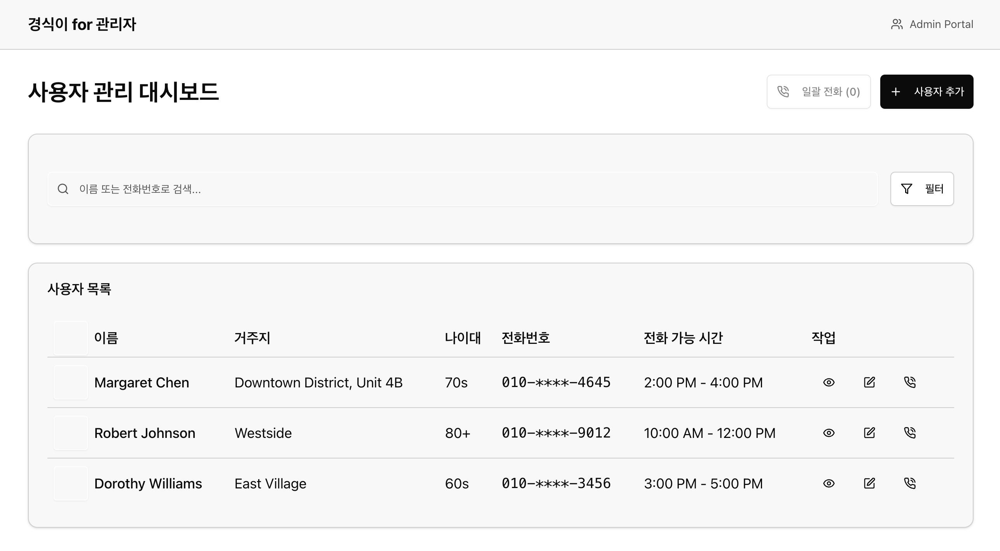
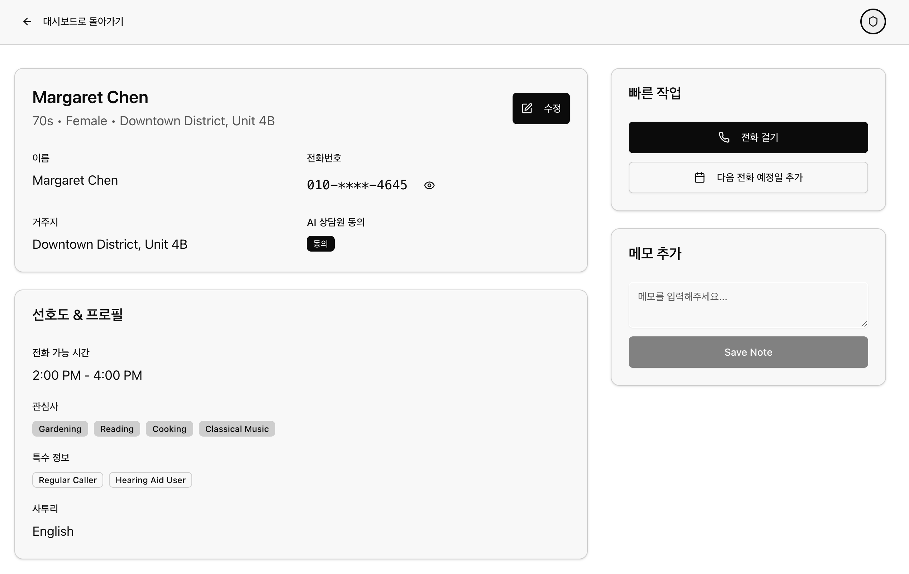

### 1. 프로젝트 소개

어르신 여가생활 안내 AI 전화 서비스 "경식이"는 디지털 접근성 장벽으로 인한 정보 격차 문제를 해결하기 위한 음성 기반 맞춤형 추천 서비스입니다.

#### 1.1. 개발배경 및 필요성
- **정보 접근의 한계**: 온라인/앱 기반 정보는 어르신들에게 접근 장벽이 높음
- **심리적 거리감**: 복잡한 디지털 인터페이스로 인한 사용 부담감
- **획일적 정보 제공**: 개인별 생활 패턴과 선호도를 고려하지 않은 일방적 정보 전달
<br/>

#### 1.2. 개발목표 및 주요내용
친근한 음성 대화를 통해 어르신들의 여가생활을 풍요롭게 만드는 개인 맞춤형 AI 비서 구현
- 안부 인사로 시작하는 자연스러운 대화
- 생활 패턴 이해 기반 맞춤형 문화 행사 및 맛집 추천
- 지역 소상공인 연계 쿠폰 발행 및 알림톡 전송
<br/>

#### 1.3. 세부내용
- **대화형 인터페이스**: 전화 통화 형태의 자연스러운 음성 상호작용
- **맞춤형 추천 엔진**: 개인별 선호도와 생활 패턴 학습 기반 추천
- **지역 연계 서비스**: 지역 문화시설 및 소상공인 업체 정보 연동
- **접근성 최우선**: 스마트폰 앱 설치 없이 일반 전화로 이용 가능
<br/>

#### 1.4. 기존 서비스(상품) 대비 차별성
- **음성 우선 설계**: 앱 설치나 복잡한 조작 없이 전화 한 통으로 해결
- **인간적 소통**: 안부 대화부터 시작하는 따뜻한 커뮤니케이션
- **생활 맞춤형**: 단순 정보 나열이 아닌 생활 방식 이해 기반 추천
- **지역 경제 연계**: 추천과 동시에 실질적 혜택(쿠폰) 제공으로 지역 상권 활성화
<br/>

#### 1.5. 사회적 가치 도입 계획
- **디지털 포용**: 디지털 소외계층의 정보 접근성 향상
- **지역 상생**: 소상공인과 어르신을 연결하는 상생 플랫폼 구축
- **사회적 돌봄**: 정기적 안부 확인을 통한 사회적 관계망 강화
<br/>


### 2.상세설계
#### 2.1. 시스템 구성도

<br/>

#### 2.3. 사용기술
| 이름                  | 버전    | 용도 |
|:---------------------:|:-------:|:-----|
| Python                | 3.11.0  | 백엔드 메인 언어 |
| FastAPI               | 0.104.0 | API 서버 프레임워크 |
| FastMCP               | 1.0.0   | 음성 처리 및 통신 |
| OpenAI                | 1.3.0   | AI 모델 연동 |
| Next.js               | 14.0.0  | 프론트엔드 프레임워크 |
| React                 | 18.2.0  | UI 컴포넌트 |
| TypeScript            | 5.2.0   | 타입 안전성 |
| Tailwind CSS          | 3.3.0   | 스타일링 |
| PostgreSQL            | 15.0    | 데이터베이스 |
<br/>


### 3. 개발결과
#### 3.1. 전체시스템 흐름도
- 유저 플로우 차트
  

- 테스크 플로우 차트
  

- 시스템 플로우 차트
  


<br/>

#### 3.2. 기능설명

관리자용 서비스입니다.

##### ` 메인 대시보드 페이지 `


- 사용자 목록 테이블뷰
  - 사용자 목록을 테이블뷰로 보여줍니다. <br/>

- 일괄 전화 버튼
  - 일괄 전화 버튼을 클릭하면 선택한 사용자 목록에 대해 일괄 전화 발신 요청을 보냅니다. <br/>

- 필터, 키워드 검색
  - 필터, 키워드 검색을 통해 사용자 목록을 검색할 수 있습니다. <br/>

- 사용자 상세 페이지 이동 버튼
  - 사용자 상세 페이지 이동 버튼을 클릭하면 사용자 상세 페이지로 이동합니다. <br/>
<br/>

##### `사용자 상세 페이지`


- 기본 정보
  - 이름, 전화번호, 거주지 등 기본 정보를 보여줍니다. <br/>

- 선호 정보
  - 선호 정보를 보여줍니다. <br/>

- 최근 통화 기록
  - 최근 통화 기록을 보여줍니다. <br/>
<br/>

#### 3.4. 디렉토리 구조
```
├── build/                      # webpack 설정 파일
├── config/                     # 프로젝트 설정 파일
├── deplay/                     # 배포 설정 파일
├── src/                        # 소스 코드
│   ├── assets/                 # 이미지, 폰트 등의 정적 파일
│   ├── pages/                  # 화면에 나타나는 페이지
│   │   ├── page1/              # 페이지1
│   │   ├── page2/              # 페이지2
│   │   ├── components/         # 여러 페이지에서 공통적으로 사용되는 컴포넌트
│   ├── router/                 # 라우터
│   ├── store/                  # global state store
│   ├── styles/                 # 스타일
│   ├── utils/                  # 유틸리티
├── static/                     # 정적 파일
```
<br/>


### 4. 사용 방법

**📞 전화번호: +1 775 368 9561**

경식이를 이용하시려면 위 번호로 전화를 걸어주시면 됩니다.

#### 📋 이용 안내
- **통화료 무료**: 발신자, 수신자 구분 없이 저희가 모든 통화료를 부담합니다
- **24시간 이용 가능**: 언제든지 부담 없이 전화해주세요
- **간단한 사용법**: 
  1. +1 775 368 9561로 전화 걸기
  2. 경식이의 안부 인사에 응답하기
  3. 원하는 정보나 추천 요청하기
  4. 맞춤형 추천 받기

#### 💡 이용 팁
- 처음 통화 시 거주 지역과 관심사를 알려주시면 더 정확한 추천을 받을 수 있습니다
- 정기적으로 통화하시면 개인 맞춤형 서비스가 더욱 향상됩니다
- 쿠폰이나 혜택 정보는 문자메시지로도 받아보실 수 있습니다
<br/>


### 5. 소개 및 시연영상
<video width="700" controls>
  <source src="./docs/demo.mp4" type="video/mp4">
</video>

<br/>

### 6. 팀 소개
| 김은종 | 장윤영 | 정유진 | 김도완 |
|:-------:|:-------:|:-------:|:-------:|
| eunjong147@pusan.ac.kr | xxxiynyng@gmail.com | jyj4221@naver.com | kimdowan1004@naver.com |
| Voice Agent 개발 | 기획 | 백엔드 개발 | 프론트엔드 개발 |


<br/>


### 7. 해커톤 참여 후기
- **김은종 (Voice Agent 개발)**
  > 음성 AI 개발은 처음이라 기술적으로 난이도가 있었지만, 그만큼 재미있는 도전이었습니다. 특히 실제 할머니들이 테스트하면서 "이거 정말 좋네, 저거도 해줘" 하시는 모습을 보니 뿌듯했고, 개발자로서 정말 의미 있는 프로젝트였다고 생각합니다.

- **장윤영 (기획)**
  > IT 서비스 기획을 처음 해봤는데 생각보다 정말 재미있었습니다. 사용자 관점에서 서비스를 설계하고, 팀원들과 아이디어를 구체화해나가는 과정이 창의적이고 보람찼습니다.

- **정유진 (백엔드 개발)**
  > 실제 사용자가 있는 백엔드를 개발하는 것은 처음이었는데, 단순히 기능 구현을 넘어서 사용자 경험을 고려한 안정적인 시스템을 만드는 것의 중요성을 깨달았습니다. 실사용자의 피드백을 받으며 개발할 수 있어서 값진 경험이었습니다.

- **김도완 (프론트엔드 개발)**
  > 실제 사용성을 고려한 프론트엔드를 직접 디자인하고 개발하니 기존 과제와는 완전히 다른 느낌이었습니다. 어르신들의 사용 패턴을 고려한 UI/UX 설계가 얼마나 중요한지 배웠고, 실제 사용자를 위한 개발의 보람을 느꼈습니다.
<br/>
